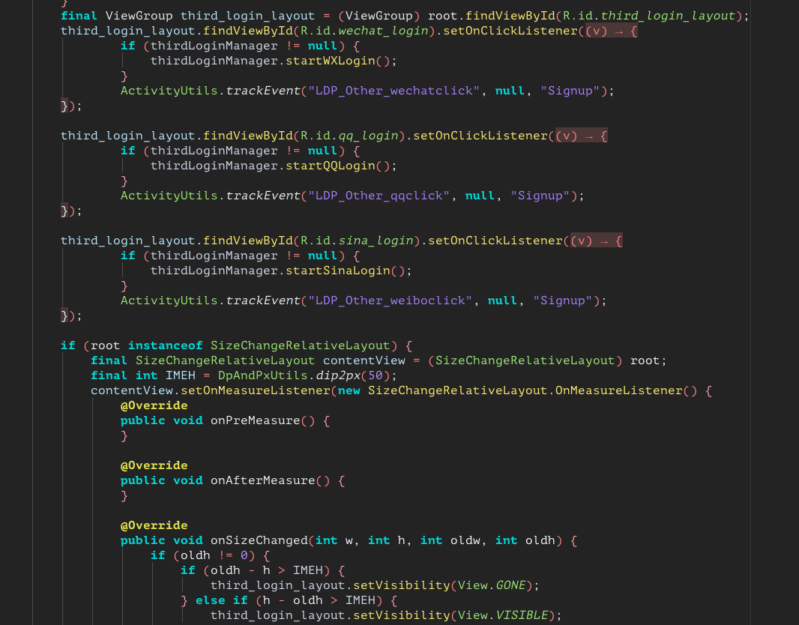
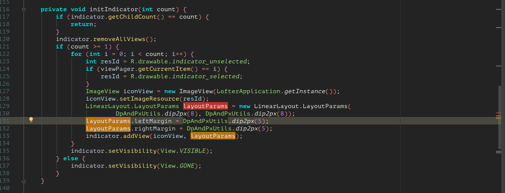
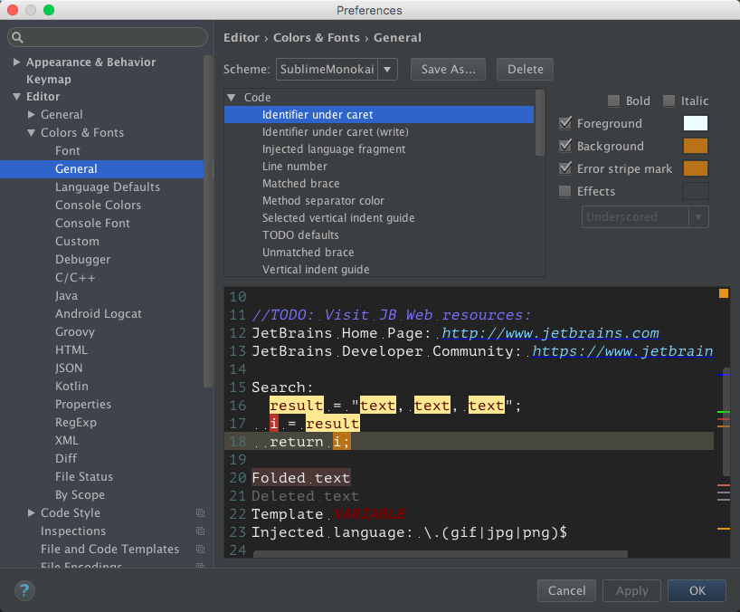

## AndroidStudio-JavaCodeColor
####基于 SublimeMonokai 的Android Studio 自定义配色方案

因为在网上一直没有找到自己喜欢的配色方案，所有自己在 SublimeMonokai 方案的基础上进行了部分颜色的自定义，在使用的过程中不断的调整，目前算是调整到了一个比较满意的状态，所以拿出来分享给大家

#### 使用的话直接 File-->Import Settings 然后选中 AS_baseColor.jar 文件 就可以了

---
##这里是一些比较有用的颜色配置

不知道大家有没有这样的烦恼，就是原来AS默认的选中一个单词，然后高亮所有单词的颜色太淡了，在代码比较多的时候比较难找出来，特别是在右边那条线上的标识更是难以发现，这里我把这个属性找出来了

* 在这里 `Identifier under caret` 代表的是 光标所在的标识符，也就是我们当前选中的单词，然后右边三个颜色，`Foreground`和`Background`是设置字的颜色，`Error stripe mark`是当前的选中在右边线上的标识颜色

* `Identifier under caret(write)`代表的是 这个标识符在代码里面被写入的地方，也可以理解为这个标识符被修改的地方，然后颜色设置的话同上